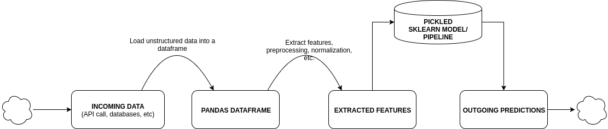

## Machine Learning-based Email Classifier Backend API Program

What this is: This is an end-to-end implementation of an email classifier. Given a new email, a pyspark ml classification model will
assess which folder a user should place their email in, giving them automatic organization.

Business case: Say you're at a company that's processing a lot of email messages. We want to save employees time by binning their incoming messages
into appropriate folders. There's another filter that is already processing for spam, so we are not worried about that. However, of the messages
that continue to get to the user, there needs to be further hierarchy. We will want the internal company emails to be placed in one folder, while
the employee's personal email are sent in another. We'll also want external client emails in a folder of their own. While Outlook and Regex
are definitely helpful in this manner, a trained machine learning approach will help employees manage workload automatically by not having them
assess each new type of email. A couple of companies have already implemented such a system to my knowledge. 

Note: Used for educational purposes only.



## Project Instructions 

### Getting Started

1. Clone the repository, and navigate to the downloaded folder.
```
git clone https://github.com/philip-sparks/Springboard-AI/email_capstone/
```

2. Download dataset.

	  - [Kaggle mirror](https://www.kaggle.com/wcukierski/enron-email-dataset/version/1)
    ```
    1. Put downloaded data into `data` folder
    2. Unzip to show an `emails.csv` file
    ```
    - [Tagged emails](http://www.d.umn.edu/~tpederse/enron.html)
    
    ```
    1. Place this data into data folder
    2. Convert all .cd3 files into .csv
    3. Rest of the project should stay the same
    ```
3. Setup your Amazon S3 buckets.
  - [Amazon S3](https://s3.console.aws.amazon.com/s3/)
    ```
    1. Select "Create bucket", with a unique name, but no special configuration settings
    2. Create the following four folders: `emails_tagged`, `emails_nontagged`, 
        `pipeline`, `trained_model`
    3. Place the Kaggle mirror `emails.csv` file within `emails_nontagged`
    4. Place the tagged email folders within `emails_tagged`
    ```

4. Create an Amazon EMR instance.
  - [Amazon EMR](https://console.aws.amazon.com/elasticmapreduce/)
    ```
    1. Select "Create cluster"
    2. Set the s3 folder to the location of your bucket.
    3. Use the Spark application with any emr-5.2x release.
    4. Set your instance type to m5.xlarge (or possibly m5.2xlarge)
    5. Use a PEM key for your EC2 key pair. You cannot SSH in without one.
    6. Select "Create cluster" again
    ```
5. Change AWS Security Group settings.
  - [Amazon EC2 Security Groups](https://console.aws.amazon.com/ec2/home?region=us-east-1#SecurityGroups)
    ```
    1. Select your ElasticMapReduce-master node
    2. On the "Inbound" tab, select `Edit`
    3. Add a rule type of SSH at 22 for a source of 0.0.0.0/0 to open the SSH tunnel
    4. Add a rule type of HTTP at 80 for a source of 0.0.0.0/0 to open the homepage.
    5. Add a rule type of TCP at 1234 for a source of 0.0.0.0/0 to open the /predict API 
    ```
6. Install Filezilla and SSH into your EC2-EMR instance
   - [Filezilla](https://filezilla-project.org/download.php?platform=osx)
    ```
    1. File -> Site Manager... -> New site
    2. Options: Protocol = SSH, Host = ec2 URL (e.g. ec2-54-160-243-194.compute-1.amazonaws.com)
    3. Options (cont.): Logon Type = Key file, User = hadoop, Key file = AWS created key.pem
    4. Hit "Connect"
    5. Copy code folder into EC2 box
    ```
7. SSH and setup model
    ```
    1. Login: ssh -i ~/Downloads/sb-test-1.pem hadoop@ec2-34-229-64-64.compute-1.amazonaws.com
    2. cd email_prod_folder; sudo pip install -r requirements.txt
    3. python (or spark-submit) preprocessing.py
    4. python (or spark-submit) train.py
    5. python unittests.py
    - Your model has been trained, tested and is now ready for production.
    ```
8. Start the app.py file and test.
```
    1. python app.py
    2. Go to your EC2 instance at port 1234. e.g.http://ec2-54-160-243-194.compute-1.amazonaws.com:1234/
    3. You'll be given a welcome message and instructions for accessing the model.
    4. Open another terminal and type the following command:curl -H "Content-Type: application/json" -d '{"Body" : "Your Message"}' http://your-ec2-instance.compute.amazonaws.com:1234/predict
    5. If you received a prediction back, congratulations! That's what the proceeding 35 steps were for.
```

## FAQ

#### How do I log or create a log script?

Spark logging is within the S3 bucket.

#### Check this statement:

The Flask approach works, but it is not scalable. Another service, such as Kafka or Kinesis, would be needed to handle thousands of requests
at a time.

#### Where should we put preprocessing/model/test files?

For simplicity, these files would go into another S3 bucket.